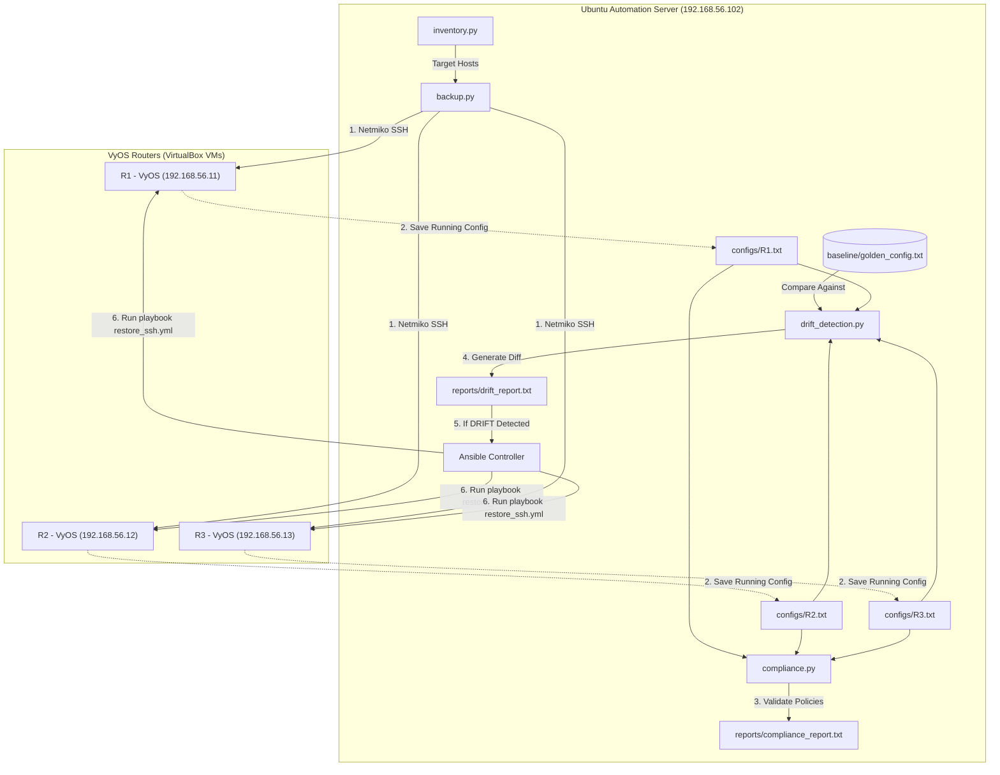
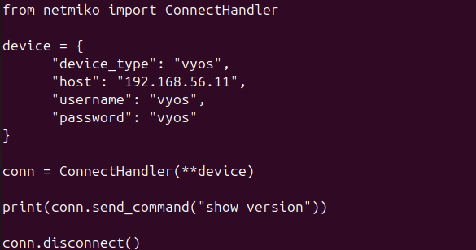
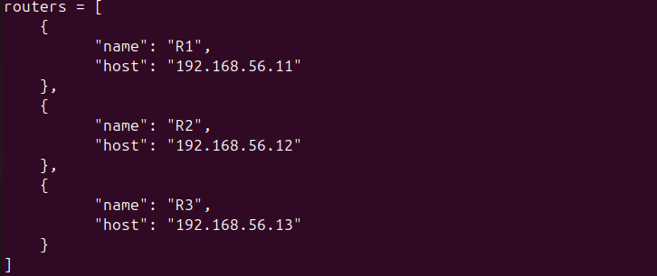
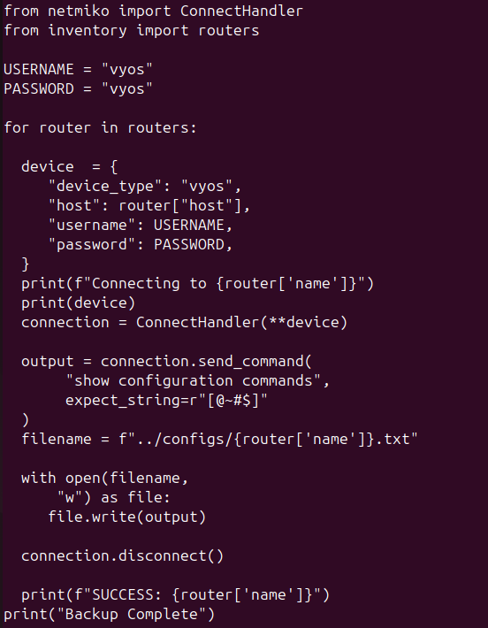
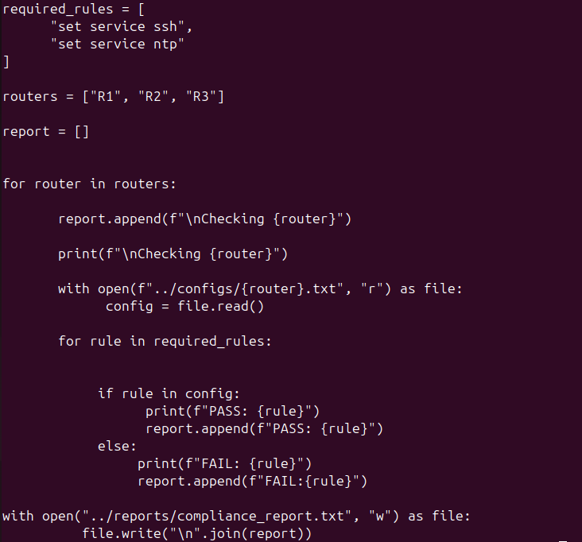
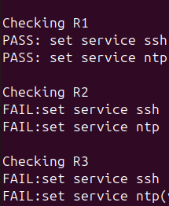
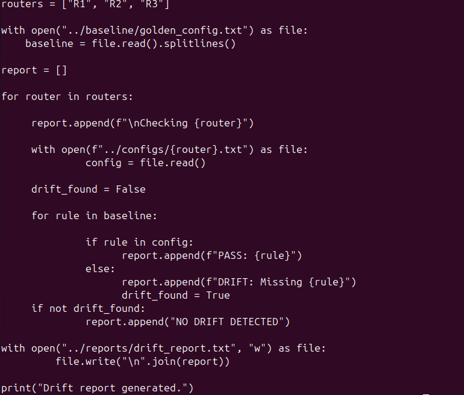
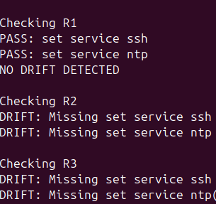
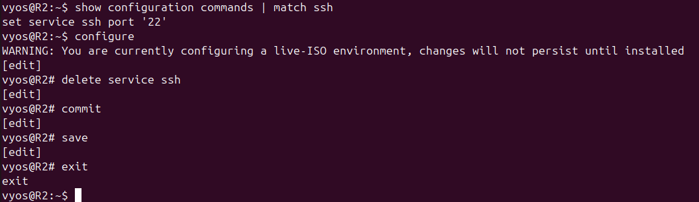

# Network Compliance & Automated Remediation Pipeline
### *Automated Multi-Router Configuration Backup, Compliance Validation, Drift Detection, and Remediation using Python, Netmiko, Ansible, and VyOS*

[](https://www.python.org/)
[](https://www.ansible.com/)
[](https://github.com/ktbyers/netmiko)
[](https://vyos.io/)
[](LICENSE)

---

## 1. Project Summary

The **Network Compliance & Automated Remediation Pipeline** is an enterprise-grade, closed-loop network automation platform designed to manage, monitor, and remediate multi-router networks. In modern network infrastructures, configuration drift and non-compliance pose significant security and operational risks. This project addresses these challenges by combining lightweight Python scripts utilizing **Netmiko** for configuration collection and compliance auditing, with **Ansible** for declarative configuration deployment and self-healing automated remediation.

This repository serves as a showcase of production-ready infrastructure-as-code (IaC) principles applied to network security, operations, and compliance. It is specifically tailored to demonstrate proficiency for roles such as:
* **Network Automation Engineer** (Python, Netmiko, Ansible Integration)
* **Network Security Engineer / Analyst** (Configuration Compliance, Auditing, Hardening)
* **NOC Automation / Infrastructure Engineer** (Configuration Backups, Drift Monitoring, Self-Healing Operations)

---

## 2. Project Architecture

The architecture implements a **closed-loop automation workflow** consisting of four distinct phases: configuration collection, compliance verification, drift detection, and automated remediation.

### High-Level Topology & Flow
```
                +---------------------------------------+
                |         Ubuntu Server 20.04           |
                |           Automation Node             |
                |            192.168.56.102             |
                +-------------------+-------------------+
                                    |
            ------------------------+------------------------
            |                       |                       |
            | SSH (Port 22)         | SSH (Port 22)         | SSH (Port 22)
            |                       |                       |
      +-----+-----+           +-----+-----+           +-----+-----+
      |    R1     |           |    R2     |           |    R3     |
      | VyOS Router |         | VyOS Router |         | VyOS Router |
      |192.168.56.11|         |192.168.56.12|         |192.168.56.13|
      +-----------+           +-----------+           +-----------+
```

### Automation Architecture & Data Flow



---

## 3. Directory Structure

The repository is organized according to professional software development and Ansible best practices, keeping scripts, inventory databases, configuration baselines, backups, and reports decoupled:

```text
.
├── .gitignore                     # Git ignore rules for venv, configs, and reports
├── README.md                      # Comprehensive documentation
├── requirements.txt               # Python package dependencies
├── Backup.py.png                  # Screenshot of backup.py script
├── M1.png                         # Screenshot of manual SSH deletion command on R2
├── compliance.py.png              # Screenshot of compliance.py script
├── compliance_report.txt.png      # Screenshot of compliance_report.txt output
├── drift_detection.py.png         # Screenshot of drift_detection.py script
├── drift_report.txt.png           # Screenshot of drift_report.txt output
├── inventory.py.png               # Screenshot of inventory.py script
├── test.py.png                    # Screenshot of test.py script
├── baseline/
│   └── golden_config.txt          # Golden baseline for compliance verification
├── configs/
│   ├── .gitkeep                   # Ensures configs/ directory is tracked in git
│   ├── R1.txt                     # Dynamically gathered running configuration backup
│   ├── R2.txt                     # Dynamically gathered running configuration backup
│   └── R3.txt                     # Dynamically gathered running configuration backup
├── reports/
│   ├── .gitkeep                   # Ensures reports/ directory is tracked in git
│   ├── compliance_report.txt      # Executed compliance audit results
│   └── drift_report.txt           # Executed drift detection diff outputs
├── src/
│   ├── backup.py                  # Collects configurations via Netmiko
│   ├── compliance.py              # Evaluates configurations against required_rules
│   ├── drift_detection.py         # Compares configurations against golden baseline
│   ├── inventory.py               # Defines router management IPs and names
│   └── test.py                    # Connectivity and SSH credential verification script
└── ansible/
    ├── inventory.ini              # Ansible hosts and network connection vars
    └── restore_ssh.yml            # Ansible playbook for automated remediation
```

---

## 4. Setup Guide

This guide walks you through setting up the environment from scratch, assuming an Ubuntu 20.04 / 22.04 LTS control host.

### Step 1: Install System Packages
The automation server requires Python 3, a virtual environment helper, and `sshpass` (which allows Ansible to use password authentication over SSH):
```bash
sudo apt update
sudo apt install -y python3 python3-venv python3-pip sshpass git
```

### Step 2: Set Up Python Virtual Environment
Keep the automation dependencies isolated from the system Python library:
```bash
# Clone the repository
git clone https://github.com/your-username/network-compliance-pipeline.git
cd network-compliance-pipeline

# Initialize virtual environment
python3 -m venv venv

# Activate virtual environment
source venv/bin/activate
```

### Step 3: Install Python Dependencies
Install `Netmiko` and `Paramiko` via `requirements.txt`:
```bash
pip install --upgrade pip
pip install -r requirements.txt
```

Verify python environment library versions:
* **Netmiko**: Used for multi-vendor network device SSH interaction.
* **Paramiko**: Lower-level SSH wrapper utilized by Netmiko and Ansible.

### Step 4: Install Ansible
Install Ansible on the Ubuntu Automation Server:
```bash
sudo apt-add-repository --yes --update ppa:ansible/ansible
sudo apt install -y ansible
```
To verify the installation:
```bash
ansible --version
```

---

## 5. Deployment Guide

### Virtualbox Lab Setup
To replicate the environment, build 3 VyOS router VMs and 1 Ubuntu VM in VirtualBox.
For each router, configure two Network Adapters:
1. **Adapter 1**: Host-Only Network (Used for management, SSH, Netmiko, and Ansible).
2. **Adapter 2**: NAT Network (Used for internet access to download software/updates).

### VyOS Management Configuration
Power on the VyOS router instances and configure the hostnames, host-only interfaces, and SSH service.

On **R1**:
```text
configure
set system host-name R1
set interfaces ethernet eth0 address 192.168.56.11/24
set service ssh port 22
commit
save
exit
```

On **R2**:
```text
configure
set system host-name R2
set interfaces ethernet eth0 address 192.168.56.12/24
set service ssh port 22
commit
save
exit
```

On **R3**:
```text
configure
set system host-name R3
set interfaces ethernet eth0 address 192.168.56.13/24
set service ssh port 22
commit
save
exit
```

### Validate Basic Connectivity
From the Ubuntu Automation Server, ping all VyOS routers:
```bash
ping -c 3 192.168.56.11
ping -c 3 192.168.56.12
ping -c 3 192.168.56.13
```

Ensure SSH access works manually for username `vyos` and password `vyos`:
```bash
ssh vyos@192.168.56.11
ssh vyos@192.168.56.12
ssh vyos@192.168.56.13
```

---

## 6. Usage Guide

### 1. Test Script Execution (`test.py`)
Run the connectivity testing script to confirm Netmiko can log in to R1 and execute `show version`.

```bash
cd src
python3 test.py
```
#### Source Screenshot Reference: `test.py`


### 2. Device Inventory (`inventory.py`)
This file houses the target hostnames and IPs. 

#### Source Screenshot Reference: `inventory.py`


### 3. Running Configuration Backup (`backup.py`)
Run the backup script to query all configured routers, pull their active commands, and export them into the `configs/` folder.

```bash
python3 backup.py
```
#### Source Screenshot Reference: `backup.py`


Upon completion, you will find baseline files saved under:
* `configs/R1.txt`
* `configs/R2.txt`
* `configs/R3.txt`

### 4. Running Compliance Audits (`compliance.py`)
Run the compliance validator to verify if R1, R2, and R3 adhere to required rule standards (SSH & NTP).

```bash
python3 compliance.py
```
#### Source Screenshot Reference: `compliance.py`


#### Generated Report Screenshot Reference: `compliance_report.txt`


### 5. Executing Drift Detection (`drift_detection.py`)
Compare current router configurations against the Golden Baseline.

```bash
python3 drift_detection.py
```
#### Source Screenshot Reference: `drift_detection.py`


#### Generated Report Screenshot Reference: `drift_report.txt`


### 6. Executing Ansible Playbooks (`ansible-playbook`)
Verify Ansible ping connectivity and run the remediation playbook:

```bash
cd ../ansible
# Perform connection test ping
ansible all -i inventory.ini -m ping

# Execute self-healing config restoration
ansible-playbook -i inventory.ini restore_ssh.yml
```

---

## 7. Workflow Explanation

The pipeline runs in a continuous workflow, transitioning dynamically from **monitoring** to **assessment** to **remediation**:

```
[ Step A: Golden Baseline ]
           │
           ▼
[ Step B: Backup Running Configs ] ──► (backup.py Netmiko SSH)
           │
           ▼
[ Step C: Compliance Validation ] ──► (compliance.py rule checker)
           │
           ▼
[ Step D: Configuration Drift Detection ] ──► (drift_detection.py Golden Config Diff)
           │
      ┌────┴────────────────────────┐
      ▼                             ▼
[ NO DRIFT ]                 [ DRIFT DETECTED ]
  (Exit)                            │
                                    ▼
                             [ Step E: Ansible Remediation ] ──► (restore_ssh.yml config deployment)
                                    │
                                    ▼
                             [ Step F: Re-run Backups & Compliance ] ──► (Verify Compliance PASS)
```

1. **Baseline Creation**: Define target configuration lines inside `baseline/golden_config.txt`.
2. **Backups Collection**: `backup.py` pulls active configuration commands from devices using Netmiko.
3. **Auditing**: `compliance.py` runs policy checking.
4. **Drift Assessment**: `drift_detection.py` compares current files with baseline settings line-by-line.
5. **Self-Healing Loop**: If drift is identified, the Ansible playbook `restore_ssh.yml` runs to declaratively configure the routers back to standard.
6. **Re-Validation**: The python backup and compliance engines run again to verify policy matches `PASS`.

---

## 8. Compliance Engine Explanation

The compliance validation is handled by `src/compliance.py`. Rather than using complex framework installations, the engine parses configuration text files to verify the presence of mandatory commands.

### Rule-Definition Arrays
The policy requires two key hardening rules:
```python
required_rules = [
    "set service ssh",
    "set service ntp"
]
```
These translate directly into security best practices:
1. **set service ssh**: Ensures encrypted administration channels are active.
2. **set service ntp**: Enforces Network Time Protocol synchronization, which is vital for log correlation, SIEM ingestion, and cryptographic authentication validity.

### Logic Flow
1. **Config Read**: The engine loops over the routers list and loads `../configs/{router}.txt`.
2. **Line Parsing**: It checks if each string in `required_rules` exists within the file body.
3. **Audit Log Generation**: It writes output reports to `../reports/compliance_report.txt` and terminal output:
   * `PASS`: Command line exists.
   * `FAIL`: Command line is missing.

---

## 9. Drift Detection Explanation

Drift detection monitors the environment for **unauthorized configuration alterations** (accidental admin deletes, direct console additions, etc.). It acts as an intrusion/change detection system for config changes.

The engine uses `src/drift_detection.py` and reads baseline instructions from `baseline/golden_config.txt`:

```text
set service ssh
set service ntp
```

### Detection Process
```python
for rule in baseline:
    if rule in config:
        report.append(f"PASS: {rule}")
    else:
        report.append(f"DRIFT: Missing {rule}")
        drift_found = True
```

If even one rule is missing, `drift_found` shifts to `True` and writes details directly indicating which baseline policies have vanished (e.g., `DRIFT: Missing set service ssh`). This serves as the key trigger indicating remediation is required.

---

## 10. Automated Remediation Explanation

Remediation uses Ansible's network management engine. Ansible provides a declarative workflow: we define the *desired state*, and Ansible determines the commands needed to align the router configuration.

### Ansible Inventory (`ansible/inventory.ini`)
The inventory maps host connectivity using the standard `network_cli` connection module configured for VyOS:
```ini
[routers]
R1 ansible_host=192.168.56.11
R2 ansible_host=192.168.56.12
R3 ansible_host=192.168.56.13

[routers:vars]
ansible_user=vyos
ansible_password=vyos
ansible_connection=network_cli
ansible_network_os=vyos.vyos.vyos
```

### Remediation Playbook (`ansible/restore_ssh.yml`)
The playbook applies configuration statements:
```yaml
---
- name: Ensure SSH and NTP compliance on VyOS routers
  hosts: routers
  gather_facts: no
  tasks:
    - name: Ensure SSH service is enabled on port 22
      vyos.vyos.vyos_config:
        lines:
          - set service ssh port '22'

    - name: Ensure NTP service is enabled
      vyos.vyos.vyos_config:
        lines:
          - set service ntp
```

### Closed-Loop Remediation Execution Example
We demonstrate drift and self-healing remediation by manually deleting the SSH service on R2:

#### Manual SSH Deletion Command
On **R2**, delete the SSH service:
```text
delete service ssh
commit
save
exit
```
#### Terminal Screenshot Reference: Manual SSH Deletion


Now, we run the pipeline on the Ubuntu automation server:

1. **Run Backup**: `python3 backup.py` gathers configurations, capturing R2's modified state.
2. **Run Compliance**: `python3 compliance.py` audits the configs and flags `FAIL:set service ssh` for R2.
3. **Run Drift Detection**: `python3 drift_detection.py` flags R2 as drifted: `DRIFT: Missing set service ssh`.
4. **Trigger Ansible Playbook**:
   ```bash
   ansible-playbook -i inventory.ini restore_ssh.yml
   ```
   Ansible executes SSH configuration and restores SSH access.
5. **Re-Run Compliance Check**: Running `python3 compliance.py` now outputs `PASS: set service ssh` across all devices. The network has successfully healed itself!

---

## 11. Lessons Learned

* **VirtualBox Adapter Renumbering**: Changing or removing network adapters in VirtualBox can shift router interface mapping (e.g., `eth0` changing to `eth1`), disrupting SSH connections. Interfaces must be configured statically and checked after hypervisor updates.
* **Management vs Data Planes**: Keeping Host-Only networks (for management SSH, Python, Ansible) separate from NAT networks (for internet package downloads) is standard practice. It prevents control traffic exposure on public-facing networks.
* **SSH Verification Priority**: Validating SSH connectivity manually via standard SSH clients should always precede running scripts. Automated scripts can hang or generate unclear timeout errors if base network access is broken.
* **Sequence of Network Automation**: Network configuration changes require structured commits (e.g., `commit` and `save` on VyOS). Automation scripts must account for VyOS command staging to avoid losing changes on reboot.
* **Pre-remediation Auditing**: Compliance audits should always run before executing remediation playbooks. This reduces unnecessary config writes, prevents control plane overload, and maintains clean change management logs.

---

## 12. Troubleshooting Guide

| Issue | Root Cause | Resolution |
| :--- | :--- | :--- |
| **Netmiko Timeout Error** | Router is powered off, or the interface IP is misconfigured. | Verify the router status in VirtualBox. Run `ping 192.168.56.11` to check IP connectivity. |
| **SSH Connection Failure** | SSH service is disabled on the router, or password authentication is blocked. | Log in directly via the VirtualBox console and run `show service ssh`. Ensure SSH is configured on port 22. |
| **Authentication Failures** | Wrong username/password (default is `vyos`/`vyos`). | Verify the username/password in `inventory.py` and `inventory.ini`. |
| **Ansible Ping Fails (`Failed to connect`)** | Missing `sshpass` dependency on Ubuntu Automation Server. | Install sshpass on the host system: `sudo apt install sshpass`. |
| **Missing Paramiko / Netmiko Dependencies** | Script run outside the activated Python virtual environment. | Run `source venv/bin/activate` before executing the Python automation scripts. |
| **Interface Renumbering on VyOS** | VirtualBox interface MAC address configuration changes. | Inspect interfaces with `show interfaces` on the router. Adjust config commands to match active adapters. |
| **Ansible Inventory Connection Issues** | Incorrect `ansible_network_os` or connection modules. | Ensure `ansible_connection=network_cli` and `ansible_network_os=vyos.vyos.vyos` are set inside `inventory.ini`. |

---

## 13. Future Enhancements

* **Integration with Database Logging**: Replace flat-file reporting with structured databases like PostgreSQL to track and display compliance trends over time.
* **Slack & Webex Webhook Alerts**: Send real-time drift alerts to network operations channels when drift is detected.
* **CI/CD Pipeline Integration**: Trigger compliance testing automatically using Git repositories and GitLab CI/CD or GitHub Actions upon commit.
* **Multi-Vendor Configuration Support**: Extend inventory configurations to support Arista EOS, Cisco IOS-XE, and Juniper Junos devices in the network topology.

---
